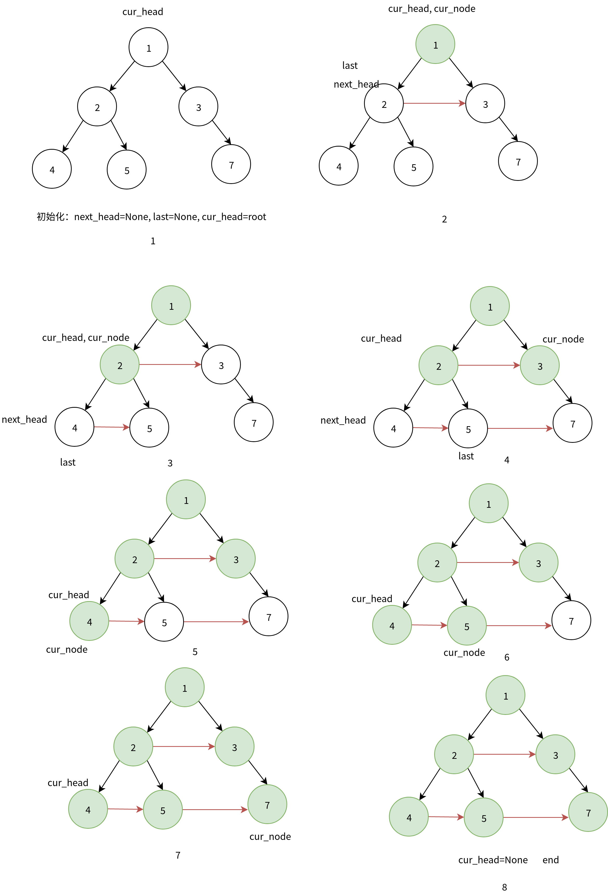

# LeetCode每日一题：填充每个节点的下一个右侧节点指针 

`二叉树` `层序遍历`

## 题目

LeetCode117：[填充每个节点的下一个右侧节点指针 II](https://leetcode-cn.com/problems/populating-next-right-pointers-in-each-node-ii/)

#### 题目描述

下面是leetcode的原题描述，建议直接看示例和输入输出，我觉得题目前面部分的描述不是很清晰。

给定一个二叉树

```C
struct Node {
  int val;
  Node *left;
  Node *right;
  Node *next;
}
```


填充它的每个 next 指针，让这个指针指向其下一个右侧节点。如果找不到下一个右侧节点，则将 next 指针设置为 NULL。

初始状态下，所有 next 指针都被设置为 NULL。

**进阶**：

- 只能使用常量级额外空间。
- 使用递归解题也符合要求，本题中递归程序占用的栈空间不算做额外的空间复杂度。

**示例**：


```
输入：root = [1,2,3,4,5,null,7]
输出：[1,#,2,3,#,4,5,7,#]
解释：给定二叉树如图 A 所示，你的函数应该填充它的每个 next 指针，以指向其下一个右侧节点，如图 B 所示。
```


提示：

- 树中的节点数小于 6000
- -100 <= node.val <= 100

## 题解

由于原题的描述有点绕，我更简单的描述一下这道题的题意。根据上面的示例和输入输出，实际上，**这道题要做的是：对于二叉树的每一层上的每个节点，如果这个节点存在右兄弟节点，则其next指针指向右兄弟节点，如果没有右兄弟节点则指空。或者说每一层为从走到右的链表。**

### 暴力求解

根据题意很容易想到二叉树的层序遍历，从上层到下层，每一层中从左到右遍历，然后改指针就行。那具体怎么实现呢？我们先**暴力求解**。

用变量cur_layer表示当前遍历层，next_layer表示下一层。两个变量均为数组类型，并且按照从左到右的顺序存储节点。

```
初始化：cur_layer=[root]，next_layer=[]
当cur_layer不空时循环：
    1. 查找next_layer，并从左到右添加节点。
    	 对于cur_layer中的每个节点node：
    	     如果node.left存在，则加入next_layer
    	     如果node.right存在，则加入next_layer
    2. 对于cur_layer数组内的每个元素cur_layer[i]，将其next指针指向其右兄弟节点。
       cur_layer[i].next=cur_layer[i+1]
    3. 两数组更新，cur_layer=next_layer，next_layer=[]，开始下一轮循环。
```

### Python实现

```python
# Definition for a Node.
class Node:
    def __init__(self, val: int = 0, left: 'Node' = None, right: 'Node' = None, next: 'Node' = None):
        self.val = val
        self.left = left
        self.right = right
        self.next = next


class Solution:
    def connect(self, root: 'Node') -> 'Node':
        if not root:
            return root
        cur_layer = [root]
        next_layer = []
        while cur_layer:
            # find nodes in next layer
            for node in cur_layer:
                if node.left:
                    next_layer.append (node.left)
                if node.right:
                    next_layer.append (node.right)

            # set next point
            for i in range (len (cur_layer) - 1):
                cur_layer[i].next = cur_layer[i + 1]

            # update
            cur_layer[-1].next = None
            cur_layer = next_layer
            next_layer = []
        return root
```

**结果**


**复杂度分析**

时间复杂度：每个节点只遍历一遍，时间复杂度O(n)

空间复杂度：引入两个数组cur_layer，next_layer，空间复杂度O(n)

### 进阶求解

题目进阶部分要求使用常量级空间复杂度。暴力求解中，我们为了保证每一层内的遍历顺序从左到右，使用了两个额外的数组记录遍历顺序，要优化，首先要解决：如何用几个变量也能保证遍历顺序。这道题的目的是，用next指针，从左到右将兄弟节点连成链表。对于链表，我们只要知道头节点就可以遍历剩余节点，同时它又是一棵树，只要我们知道第i层的链表结构，就可以根据该层上每个节点的左右孩子节点信息，将i+1层的节点连成链表。因此，**求解的核心思想是：利用第i层的链表结构，确定i+1层节点的链接关系。**

#### 具体算法流程：

引入变量cur_head当前层头节点，cur_node当前节点，next_head下一层头节点，last下一层上一个添加next指针的节点。

1. 初始化cur_head=root，cur_node=root

2. 当cur_head不为空(还有层未遍历)时循环：

   2.1 next_head=None，last=None

   2.2 对于层内的每个节点cur_node，

   ​	2.2.1 如果cur_node.left存在

   ​				如果next_head为空，则cur_node.left节点为下一层的头结点

   ​				如果last不为空，则说明cur_node.left的上一个节点为last， 将last的next指针指向cur_node.left

   ​				将last指针更新为cur_node.left

   ​	2.2.2 如果cur_node.right存在，

   ​				如果next_head为空，则cur_node.right节点为下一层的头结点

   ​				如果last不为空，则说明cur_node.tight的上一个节点为last， 将last的next指针指向cur_node.right

   ​				将last指针更新为cur_node.right

   2.2  当前层遍历结束，cur_head指向下一层的头结点

3. 结束，所有层遍历完，放回添加完next指针的树。

**备注:** 

1. 算法流程中的2.2.1 和2.2.2 中存在重复逻辑，可以抽象出来，具体见代码实现的add_next方法。
2. 由于每一个节点的next指针默认为None，所以每一层的最后一个节点不需要再指空。

**下图以示例为例子，展开描述算法流程。**



1. 初始化cur_head=1，cur_node=1  [图1]
2. cur_head不为空, next_head=None，last=None  [图1]
   1. cur_node.left(2)存在，next_head为空，将next_head设为2， last设为2 [图2]
   2. cur_node.right(3)存在，last的next指针指向3，last=3  [图2]
3. 1的next为空，没有右边兄弟节点，第一层循环结束，cur_head移到下一层next_head(2),cur_node=2， next_head=None，last=None  [图3]
   1. cur_node.left(4)存在，next_head为空，将next_head设为4， last=4 [图3]
   2. cur_node.right(5)存在，4的next指针指向5，last=5  [图3]
4. cur_node=cur_node.next(3), 
   1. cur_node.left不存在
   2. cur_node.right(7)存在，last(5)的next指针指向7，last=7 [图4]
5. 3的next为空，没有右边兄弟节点，第二层循环结束，ctuur_head移到下一层next_head(4),cur_node=4， next_head=None，last=None  [图5]
6. cur_node 4 没有左右子节点，右移 [图5]；cur_node 5 没有左右子节点，右移 [图6]；cur_node 7 没有左右子节点，右移 [图7]
7. cur_head=next_head， cur_head为空，遍历完所有层，结束[图8]

### Python实现

```python
class Solution:
    def __init__(self):
        self.next_head = None
        self.last = None

    def add_next(self, next_node):
        if not self.next_head:
            self.next_head = next_node
        if self.last:
            self.last.next = next_node
        self.last = next_node

    def connect(self, root: 'Node') -> 'Node':
        if not root:
            return root
        cur_head = root
        while cur_head:
            cur_node = cur_head
            self.next_head = None
            self.last = None
            while cur_node:
                if cur_node.left:
                    self.add_next(cur_node.left)
                if cur_node.right:
                    self.add_next (cur_node.right)
                cur_node = cur_node.next
            cur_head = self.next_head
        return root
```

**复杂度分析**

时间复杂度：每个节点只遍历一遍，时间复杂度O(n)

空间复杂度：引入了4个变量，空间复杂度O(1)
