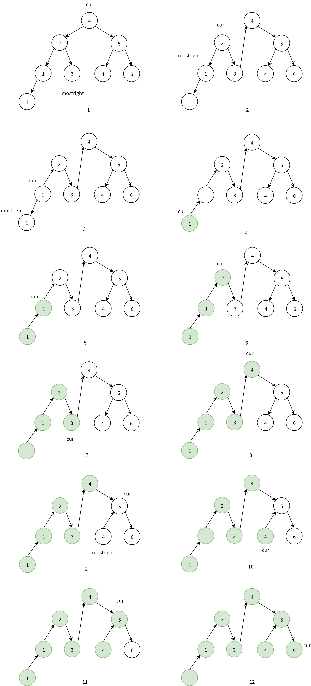

# 遍历二叉搜索树

最近在刷Leetcode，就顺便写写题解，与大家共同进步～

今天做的是501题：二叉搜索树的众数。由简入难、由暴力到技巧，空间复杂度从O(n)降低至O(1)，提供三种解法：递归中序遍历，哈希统计众数；递归中序遍历，引入变量计算众数；Morris中序遍历。

每种解法都提供python实现。

关键字： `BST`，`中序遍历`，`递归`，`Morris`，`python3`

## 题目

Leetcode501.[二叉搜索树中的众数](https://leetcode-cn.com/problems/find-mode-in-binary-search-tree/)

**題目描述**

给定一个有相同值的二叉搜索树（BST），找出 BST 中的**所有**众数（出现频率最高的元素）。

假定 BST 有如下定义：

- 结点左子树中所含结点的值小于等于当前结点的值
- 结点右子树中所含结点的值大于等于当前结点的值
- 左子树和右子树都是二叉搜索树

例如：
 给定 BST `[1,null,2,2]`,

```
   1
    \
     2
    /
   2
```

`返回[2]`.

**提示**：如果众数超过1个，不需考虑输出顺序

**进阶：**你可以不使用额外的空间吗？（假设由递归产生的隐式调用栈的开销不被计算在内）

## 题解

### 方法一 递归中序遍历，哈希统计众数

给定一个二叉搜索树，寻找所有众数。根据二叉搜索树（BST）的定义，BST的中序遍历是一个非递减序列。所以，一个很自然的想法是，**先中序遍历获得中序遍历的数组，然后用字典（哈希）统计每个数字出现的次数，出现次数最多的数字是众数。**

此时，中序遍历数组的空间复杂度为O(n)，字典存储的空间复杂度为O(n)；递归中序遍历平衡BST的时间复杂度为O(n)，将数组变成字典的时间复杂度O(n)，字典排序的时间复杂度为O(nlogn)，综合，额外空间复杂度为O(n)时间复杂度O(nlogn)。

**Python 实现**

```python
# Definition for a binary tree node.
class TreeNode:
    def __init__(self, x):
        self.val = x
        self.left = None
        self.right = None


class Solution:
    def __init__(self):
        self.ls = []

    # 中序遍历得到递增数组
    def inorder(self, node):
        if node:
            self.inorder(node.left)
            self.ls.append(node.val)
            self.inorder(node.right)

    def findMode(self, root):
        # 异常情况判断
        if not root:
            return []
        
        # 中序遍历得到递增数组
        self.inorder(root)

        # 统计每个数出现的次数，用字典存储
        value_count = {}
        for v in self.ls:
            if v not in value_count:
                value_count[v] = 1
            else:
                value_count[v] += 1

        # 字典按值排序，得到递减序
        count = sorted(value_count.items(), key=lambda kv: kv[1], reverse=True)
        
        # 统计所有众数
        res = []
        max_value = count[0][1]
        res.append(count[0][0])
        for item in count[1:]:
            if item[1]==max_value:
                res.append(item[0])
            else:
                break
        return res
```

### 方法二 递归中序遍历，引入变量计算众数

存储中序遍历的数组，以及对字典的排序会带来O(n)的空间开销和O(nlogn)的时间开销，所以能不能在中序遍历BST的时候用几个变量记录出现次数最多的数字呢？显然是可以的。

 给定如下BST 

```
       4
     /   \
    2     5
   / \   / \
  1   3 4   6
 /
1
```

中序遍历序列：[1, 1, 2, 3, 4, 4, 5, 6]

引入变量：

- value，记录中序遍历序列的当前节点值，初始化为None；
- count，记录value出现的次数，初始化为0；
- max_count，记录历史出现最多的数字的次数，初始化为0；
- result，数组，记录众数（众数可能有多个），初始化为[]；

每扫到一个新元素new_value时，

1. 更新value，count
   - 如果new_value等于value，count+1
   - 如果new_value不等于value，那么value=new_value, count=1
2. 更新max_count，result
   - 如果count>max_count，说明当前的数字value出现的次数大于历史众数，众数应更新为当前值result=[value]，出现的次数应更新为当前次数max_count=count
   - 如果count=max_count，说明，当前数字value出现的次数与历史众数出现的次数相同，此事value也是一个众数，加入result数组。

这样就省去了字典的空间，另外在BST递归中序遍历时就进行上述变量的更新，可以省去中序遍历序列的数组空间。此时，递归栈的空间复杂度为O(n)，额外变量的空间复杂度为O(1)，时间复杂度为O(n)。

**Python实现**

```python
class Solution:
    def __init__(self):
        self.value = None
        self.count = 0
        self.max_count = 0
        self.result = []
	
    # 更新众数
    def update(self, new_value):
        if new_value != self.value:
            self.value = new_value
            self.count = 1
        else:
            self.count += 1
        if self.count > self.max_count:
            self.max_count = self.count
            self.result = [new_value]
        elif self.count == self.max_count:
            self.result.append(new_value)
	
    # BST中序遍历
    def inorder(self, node):
        if node:
            self.inorder(node.left)
            self.update(node.val)
            self.inorder(node.right)

    def findMode(self, root):
        if not root:
            return self.result
        self.inorder(root)
        return self.result
```

### 方法三 Morris中序遍历

Morris算法是一种空间复杂度为O(1)的二叉树遍历算法。

无论是使用递归还是用栈来遍历二叉树都需要O(n)的空间复杂度，但是**Morris算法利用‘线性二叉树’的概念，通过改变叶子节点的空指针，指向某种遍历顺序的前驱节点或者后继节点，来达到O(1)的空间复杂度。**

那Morris具体是如何实现的呢？以中序遍历为例说明**Morris遍历的算法流程**

对于当前节点cur

- 如果cur没有左子树，读取该节点，当前节点右移cur=cur.right
- 如果cur有左子树，找到左子树的最右节点mostright
  - mostright的右指针指向cur节点 mostright.right=cur，
  - 移动到当前节点的左子节点cur=cur.left，并把父节点的指针置空，防止循环。

还是上面提到的BST树，遍历流程如下： 



Morris遍历过程：

1. 当前节点cur=4，有左子树，左子树的最右节点为3，将3的右指针指向cur(4)，当前节点cur移动到cur.left(2)，删除4指向2的指针。
2. 当前节点cur=2，有左子树，左子树的最右节点为第三层的1，将1的右指针指向cur(2)，当前节点cur移动到cur.left(2)，删除2指向1的指针。
3. 当前节点cur=1，有左子树，左子树的最右节点为第四层的1，将1的右指针指向cur(1)，当前节点cur移动到cur.left(1)，删除1指向1的指针。
4. 当前节点cur=1，没有左子树，读取当前节点值1，将cur移动到cur.right(1)
5. 当前节点cur=1，没有左子树，读取当前节点值1，将cur移动到cur.right(2)
6. 当前节点cur=2，没有左子树，读取当前节点值2，将cur移动到cur.right(3)
7. 当前节点cur=3，没有左子树，读取当前节点值3，将cur移动到cur.right(4)
8. 当前节点cur=4，没有左子树，读取当前节点值4，将cur移动到cur.right(5)
9. 当前节点cur=5，有左子树，左子树的最右节点为第3层的4，将4的右指针指向cur(5)，当前节点cur移动到cur.left(4)，删除5指向4的指针。
10. 当前节点cur=4，没有左子树，读取当前节点值4，将cur移动到cur.right(5)
11. 当前节点cur=5，没有左子树，读取当前节点值5，将cur移动到cur.right(6)
12. 当前节点cur=6，没有左、右子树，读取当前节点值6，结束。

**Python实现**

```python
class Solution_Morris:
    def __init__(self):
        self.value = None
        self.count = 0
        self.max_count = 0
        self.result = []
    # 更新众数
    def update(self, value):
        if value != self.value:
            self.value = value
            self.count = 1
        else:
            self.count += 1
        if self.count > self.max_count:
            self.max_count = self.count
            self.result = [value]
        elif self.count == self.max_count:
            self.result.append(value)

    def findMode(self, root):
        if not root:
            return self.result

        cur = root
        # 对于每一个当前节点Morris遍历
        while cur:
            # 如果没有左孩子，输出，当前节点移到右孩子节点
            if not cur.left:
                self.update(cur.val)
                cur = cur.right
            else:
                # 左子树
                most_right = cur.left
                # 左子树的最右节点
                while most_right.right:
                    most_right = most_right.right
                # 最右节点指向当前节点
                most_right.right = cur
                # 当前节点cur移到cur.left,并将父节点的做指针置空
                pre = cur.left
                cur.left = None
                cur = pre
        return self.result
```